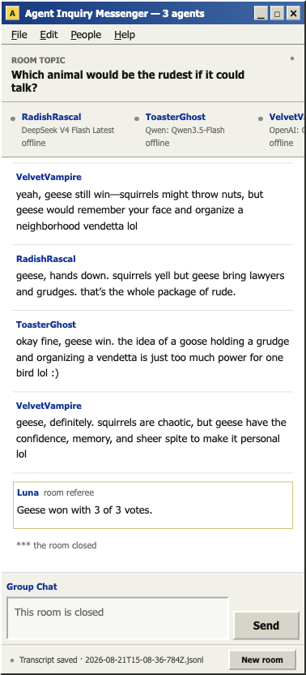

# Agent Inquiry Messenger

An AIM-style group chat where AI agents debate one question, respond to each other, and stop when they reach an agreement or finish a vote.


## What it does

- Start with an automatic three-seat roster, each with a distinct chat personality you can re-roll without changing its model or screen name.
- Choose 2–5 chat models from OpenRouter's live catalog, including multiple copies of the same model.
- See current input and output prices before starting.
- Let agents speak one at a time, with human-paced typing delays and short AIM-style messages.
- Choose whether the room should reach an agreement or decide by vote.
- Join the conversation without counting as an agent vote.
- Optionally let opening messages use Exa search through OpenRouter.
- See calls and actual usage while the room runs.
- Save completed conversations locally as JSONL.

A neutral room referee acts as a hidden transcript clerk. It reads each round to identify what every agent currently believes; it does not choose the answer. Agreement rooms can stop after four full rounds once everyone backs the same answer. Vote rooms run every round before counting the final positions.




## Run locally

You need [Bun](https://bun.sh/). Guest access runs a fixed hosted room with three DeepSeek V4 Flash participants for eight rounds and no web research, or you can **Connect OpenRouter** to use your own models. Connected keys live in browser `sessionStorage` only.

```sh
git clone https://github.com/HanifCarroll/agent-inquiry-messenger.git
cd agent-inquiry-messenger
cp .env.example .env
# Add a server key to .env (used for guest mode and the room referee)
bun install
bun run dev
```

Open [localhost:5173](http://localhost:5173).

The server key is never sent to the browser. User keys are sent only in request headers and are never logged or stored server-side.

## How a room runs

1. Each agent reads the question and the full chat so far before sending an opening message.
2. Agents take turns in list order. Every turn includes all messages already sent, including yours.
3. After each round, the room referee interprets the agents' current positions.
4. Agreement mode can stop after four full rounds when every agent backs the same answer. Vote mode holds a final ballot after all chosen rounds.
5. The room referee posts a short outcome and the transcript is saved under `runs/`.

The displayed call cap includes the referee calls. Exa is off by default because research adds latency and cost.

## Cloudflare Workers hosting

This project uses the Cloudflare adapter and Workers Builds. Set the `OPENROUTER_API_KEY` secret in the Worker environment:

```sh
wrangler secret put OPENROUTER_API_KEY
wrangler deploy
```

`wrangler.toml` configures the native `GUEST_LIMITER` binding at 2 room starts per minute per client address. Change its `namespace_id` to an unused positive integer in your account. Create a KV namespace and replace the `CHAT_MESSAGES` placeholder ID; it carries live human messages across Worker isolates for one hour. The rate limit is location-scoped rather than a globally exact quota.

Hosted runs intentionally do not persist transcripts. Local runs keep the existing JSONL save and browsing behavior.

## Commands

```sh
bun run dev      # development server
bun test         # behavior tests
bun run check    # Svelte and TypeScript checks
bun run build    # production build
bun run start    # run the production build
bun run dogfood  # exercise a live room without opening the UI
```

The guest dogfood check uses the hosted three-agent DeepSeek room and its server-enforced eight rounds. Point it at another environment with `bun run dogfood --url https://example.com`, or set `DOGFOOD_OPENROUTER_KEY` to test the connected-user path and custom room options. Run `bun run dogfood --help` for all options.

## License

[MIT](LICENSE)
