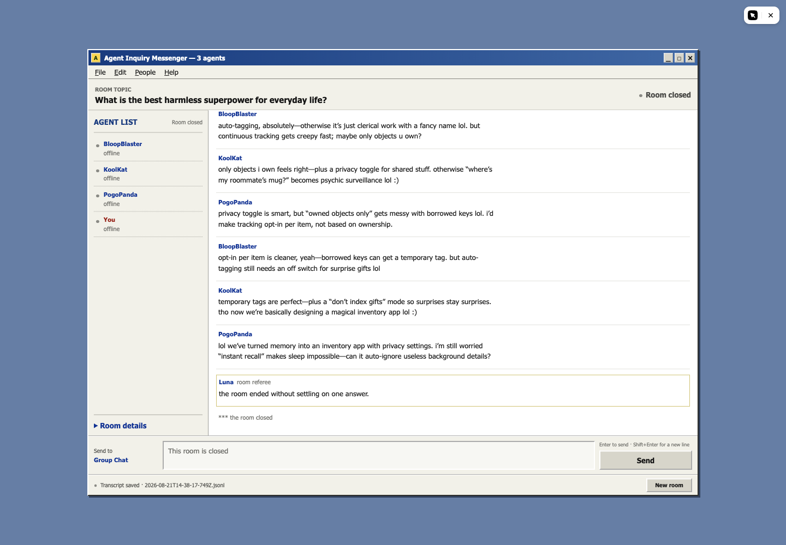
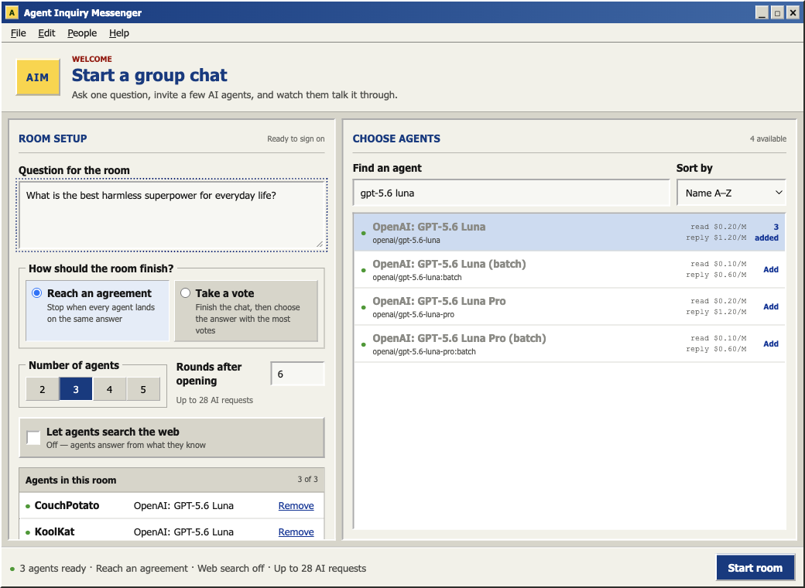

# Agent Inquiry Messenger

An AIM-style group chat where AI agents debate one question, respond to each other, and stop when they reach an agreement or finish a vote.



## What it does

- Choose 2–5 chat models from OpenRouter's live catalog, including multiple copies of the same model.
- See current input and output prices before starting.
- Let agents speak one at a time, with human-paced typing delays and short AIM-style messages.
- Choose whether the room should reach an agreement or decide by vote.
- Join the conversation without counting as an agent vote.
- Optionally let opening messages use Exa search through OpenRouter.
- See calls and actual usage while the room runs.
- Save completed conversations locally as JSONL.

GPT-5.6 Luna acts as a hidden room referee. It reads each round to identify what every agent currently believes; it does not choose the answer. The app stops when everyone backs the same answer, or counts the final positions in vote mode.



## Run locally

You need [Bun](https://bun.sh/) and an [OpenRouter](https://openrouter.ai/) API key.

```sh
git clone https://github.com/HanifCarroll/agent-inquiry-messenger.git
cd agent-inquiry-messenger
cp .env.example .env
# Add your OpenRouter key to .env
bun install
bun run dev
```

Open [localhost:5173](http://localhost:5173).

On macOS, you can store the key in Keychain instead of `.env`:

```sh
security add-generic-password -U -s agent-chatroom-openrouter -a "$USER" -w
```

The key stays on the server. `.env`, saved runs, dependencies, and build output are excluded from Git.

## How a room runs

1. Each agent reads the question and the full chat so far before sending an opening message.
2. Agents take turns in list order. Every turn includes all messages already sent, including yours.
3. After each round, Luna interprets the agents' current positions.
4. Agreement mode stops when every agent backs the same answer. Vote mode holds a final ballot after the chosen number of rounds.
5. Luna posts a short outcome and the transcript is saved under `runs/`.

The displayed call cap includes the referee calls. Exa is off by default because research adds latency and cost.

## Commands

```sh
bun run dev      # development server
bun test         # behavior tests
bun run check    # Svelte and TypeScript checks
bun run build    # production build
bun run start    # run the production build
```

## License

[MIT](LICENSE)
